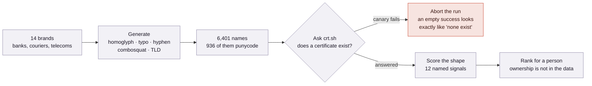

# One letter wrong

**Of 1,196 possible single-character lookalikes of fourteen Korean banks, couriers and telecoms, exactly five have ever
held a TLS certificate.**


<sub>The published write-up. Regenerate with <code>scripts/report.py</code>, then <code>docs/screenshot.sh --top 1500</code>.</sub>

## In short

| | |
|---|---|
| **Question** | How many domains built to be mistaken for a Korean bank actually exist? |
| **Answer** | 5 of 1,196 — **0.42%**. A complete answer over that space, not a sample. |
| **Method** | Generate every plausible lookalike, then ask Certificate Transparency which ones exist |
| **Status** | Finished. Both classes that produce findings were asked about in full |

## The five that exist

| Forgery | Real name | Brand | Certificates |
|---|---|---|---|
| `woor`**`l`**`bank.com` | wooribank.com | Woori Bank | 1,829 |
| `tw`**`0`**`rld.com` | tworld.com | SK Telecom | 18 |
| `t`**`vv`**`orld.com` | tworld.com | SK Telecom | 17 |
| `kbankno`**`vv`**`.com` | kbanknow.com | K bank | 14 |
| `cjlogist`**`l`**`cs.com` | cjlogistics.com | CJ Logistics | 3 |

`i` written as `l`, `w` as `vv`, `o` as `0`. Read quickly, the way anyone reads a browser bar, and the substitution
disappears — that is the whole technique.

None of them is called phishing here. A certificate proves somebody asked for a name and could show control of it,
nothing more.

## How it works



The obvious approach — searching the logs for each brand name — does not work. That query is an unindexed scan, and
the index answers it with a timeout, an error, or **success and an empty result**, which is indistinguishable from
"nothing matched". So the question is turned around: generate the names, then ask about each one exactly.

**The cost of that inversion:** this finds only the impersonations it thought to generate.

## Two rules that shape everything

**Nothing is ever resolved, fetched or visited.** Not a candidate domain, not a URL from a certificate. A lookalike is
usually hosted on somebody else's compromised machine, and even a DNS lookup tells the operator that someone is
watching.

**The output reports resemblance, never a verdict.** Most flagged names are innocent, and an unverified public
accusation is a kind of harm the rest of these projects do not risk.

## Results by class

| Class | Generated | Asked | Exist | |
|---|---|---|---|---|
| homoglyph | 1,196 | 1,196 | 5 | complete |
| hyphen | 504 | 504 | 19 | complete — and mostly the brands' own |
| tld | 297 | 15 | 11 | stopped: ordinary-word collisions |
| combosquat | 1,458 | 46 | 0 | stopped: nothing found |
| typo | 2,946 | 1 | 0 | stopped: nothing found |

The split is the finding. **Deliberate misspellings almost never exist.** Names a brand might plausibly own itself —
`woori-bank.com`, `shinhan-card.com` — exist at nine times the rate, and are mostly defensive registrations.

<details>
<summary><b>Where scoring stops being able to help</b></summary>

A brand that lets a defensive registration lapse and renews it later looks *identical* to a squatter picking one up,
and certificate transparency does not record who owns a domain. So the tool ranks shapes and a person settles
ownership in [`config/reviewed.yaml`](config/reviewed.yaml), where a verdict overrides the score and every entry needs
a date and a note saying what was actually checked.

This is the same pattern as the network project's `allowlist.tsv` and the endpoint project's `expected.yaml`.
</details>

<details>
<summary><b>What it cannot see</b></summary>

- **Only what was imagined.** One substitution at a time, from a curated table of confusable characters, across a
  short list of likely suffixes. Two substitutions, an unusual character, or a name that impersonates by structure
  rather than spelling are all invisible.
- **Fourteen brands.** Korea's other banks, couriers and retailers are outside every number here.
- **Absence decays.** It was true on the day it was asked.
- **No attribution.** No WHOIS, no DNS, no page fetched.

The long form is in [docs/limits.md](docs/limits.md); every false positive and what changed because of it is in
[docs/tuning.md](docs/tuning.md).
</details>

<details>
<summary><b>Running it</b></summary>

```console
$ scripts/check-watchlist.py            # validate the watchlist
$ scripts/check-watchlist.py --plan     # what a run would ask for, without asking
$ scripts/generate-candidates.py        # the imagined space -> ct.candidates
$ scripts/check.py --limit 150          # ask crt.sh about a budget of them
$ scripts/score.py                      # rank what exists
$ scripts/report.py                     # rebuild the page
```

`scripts/refresh.sh` runs the whole thing; a systemd timer ran it nightly until the classes that matter were complete.
Method in [docs/method.md](docs/method.md), rules in [CLAUDE.md](CLAUDE.md).
</details>

---

Part of a set: [network monitoring](https://github.com/junting9817/nsm-lab) ·
[malware traffic](https://github.com/junting9817/malware-traffic-analysis) ·
[endpoint detection](https://github.com/junting9817/endpoint-detection) ·
[honeypot reporting](https://github.com/junting9817/honeypot-report)
